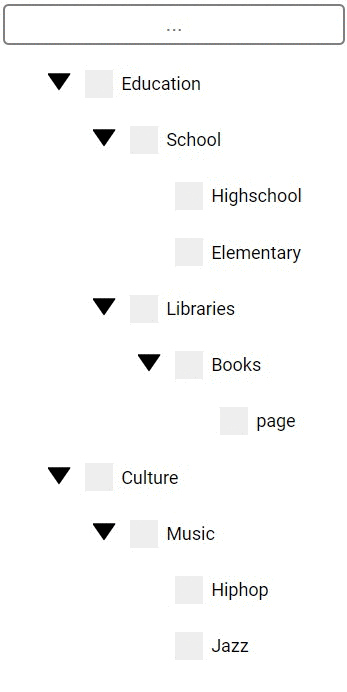

# Recursion Tree Blog Series


## The App
How to code a searchable code tree? After hours, maybe weeks, of meditation I came to the conclusion that my next goal has been 
in front of my very eyes... RECURSION. Recursion is the key 
for creating managable tree structures. 
For sure you could harcode every branch and leaf but that gets unmaintainable very quickly.
From my experience I believe that most developers evade the recursion topic, but it could
be a helpful tool for many cases not just for trees. 




## Blog

Through the blog series you will create this recursion tree.
The blog series goes into depth on how to implement

- Recursion principles
- Tree structure
- Js
- Composition
- Recursive search/filter algorithm

It has been fun making it and I hope will learn at least one thing or two
that would help you further on your own journey.

[Finding X MEN (Part1)](http://leonstel.github.io/blogs/xmen_part1)  
[Finding  X MEN - Without Italian Delicacy (Part2)](http://leonstel.github.io/blogs/xmen_part2)  
[Finding  X MEN - The Right Direction (Part3)](http://leonstel.github.io/blogs/xmen_part3)  
[Finding  X MEN - The Gathering (Part4)](http://leonstel.github.io/blogs/xmen_part4)

[Other Blog Posts](http://leonstel.github.io/)

```
npm install
npm run dev
```

After running above commands go to localhost:8080
