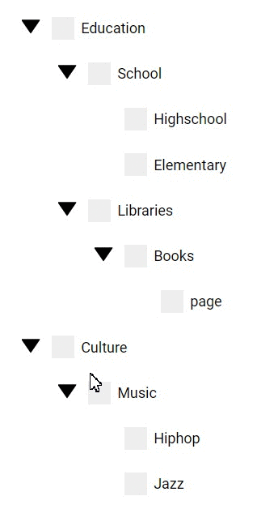

This part2 branch is the code for the blog post of the recursive tree part2 of the series

Part2 blog could be found here
http://leonstel.github.io/recursive_tree_part2

This is the result for part 2. This tree will be used in next parts as starting point for part 3.

| Before  | After |
| ------------- | ------------- |
|  | |

```
npm install
npm run dev
```

After running above commands go to localhost:8080