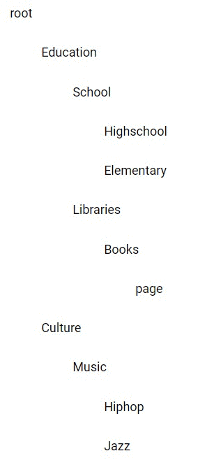

## Recursion Tree Has No Incentive to Leaf (Part1)

This part1 branch is the code for the blog post of the recursive tree part1 of the series

Part1 blog could be found here
http://leonstel.github.io/recursive_tree_part1

This is the result for part1. Visually not a piece of art but the core is about
using recursion. This tree will be used in next parts as starting point.



```
npm install
npm run dev
```

After running above commands go to localhost:8080